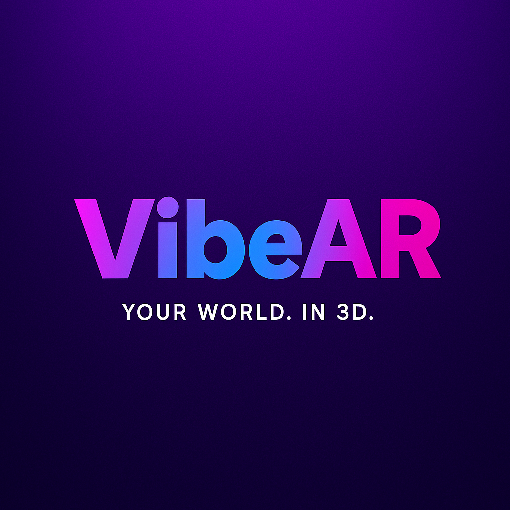

# VibeAR — AI + AR Creation Prototype  
**Create. Evolve. Cast.**

---

### Overview
**VibeAR** demonstrates how AI and AR can simplify 3D creation.  
This prototype highlights the **Create → Evolve → Cast** journey,  
a no-code design process built through **Figma** and **Stitch AI**,  
and product decisions aligned with Meta’s focus on **creativity and connection**.

---

### Brand Intent
After exploring naming options like *CastAR* and *LucidDreamAR*,  
I intentionally retained the **VibeAR** identity to emphasize  
strategic continuity, handle availability, and audience recall.  
This reflects a real-world PM approach to **branding through iteration**.

---

### Prototype & Assets
| Component | Description | Link |
|------------|--------------|------|
| **Figma Prototype** | Interactive mockups (splash, home, create, evolve, share) |https://www.figma.com/design/vZOdddjltbxUjvKpd9Sekk/VibeAR?node-id=9-823&t=b0gXw4jGdQZT6lHO-1|
| **Stitch AI Screens** | AI-generated layout previews |https://stitch.withgoogle.com/projects/11304252198732544191?pli=1|

---

### Tools
Figma · Stitch AI · Meshy 3D API (Exploratory) · Miro · Notion  

---

### Brand System
- **Gradient:** #9B5DE5 → #F15BB5 → #00BBF9  
- **Accent:** #B9FBC0  
- **Font:** Poppins SemiBold / Satoshi Medium  
- **Tagline:** *Create. Evolve. Cast.*  

---

### Next Steps
- Integrate Meshy API for 3D generation  
- Launch no-code MVP prototype  
- Conduct user testing on sharing and ethical use  
- Publish Product Case Study v2 for Meta applications  

---

### Author
**Jessica Hobson**  
[LinkedIn](https://www.linkedin.com/in/jessicahobson) | [jessicahobson@gmail.com](mailto:jessicahobson@gmail.com)
# vibear-prototype
VibeAR demonstrates how AI and AR can simplify 3D creation. This prototype highlights the Create → Evolve → Cast journey, no-code design via Figma + Stitch AI, and product decisions aligned with Meta’s focus on creativity and connection.
